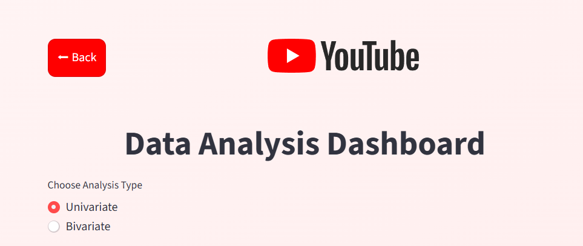
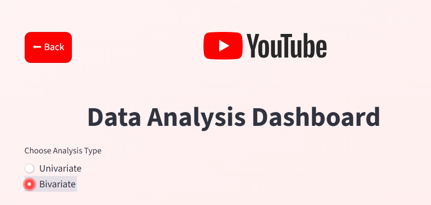
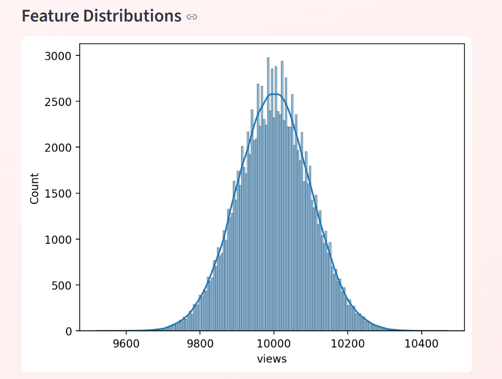
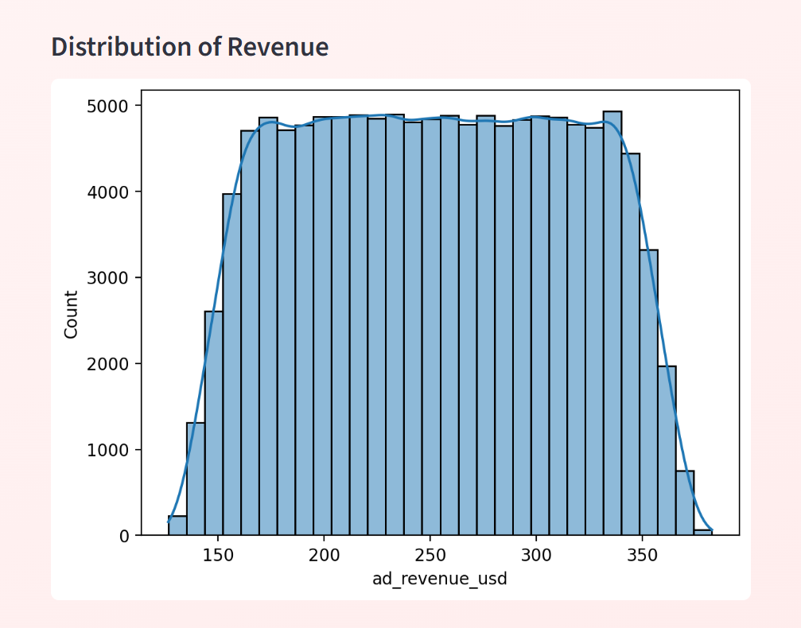
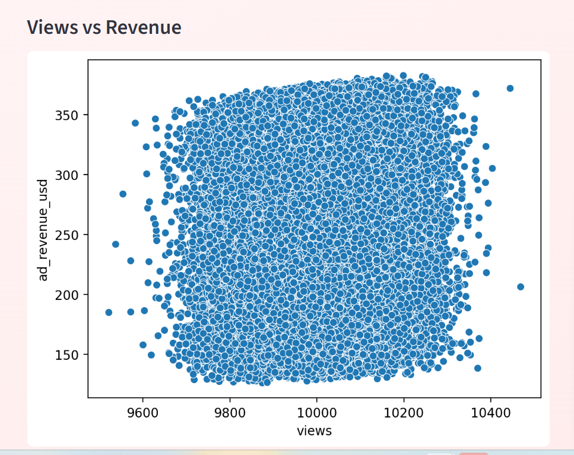
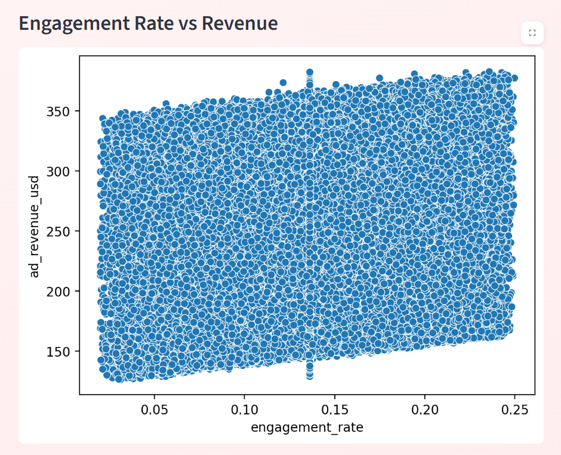
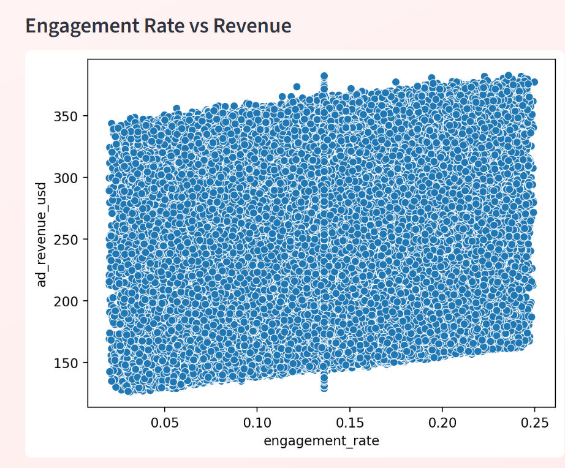
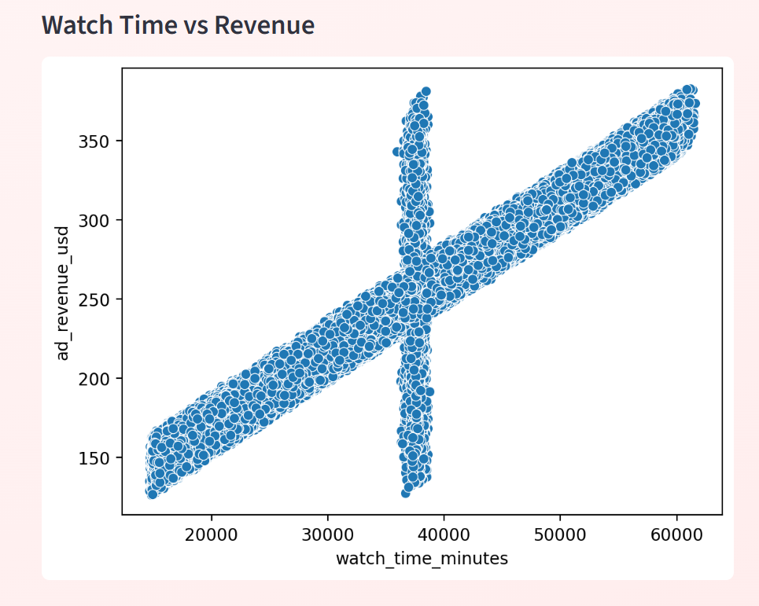
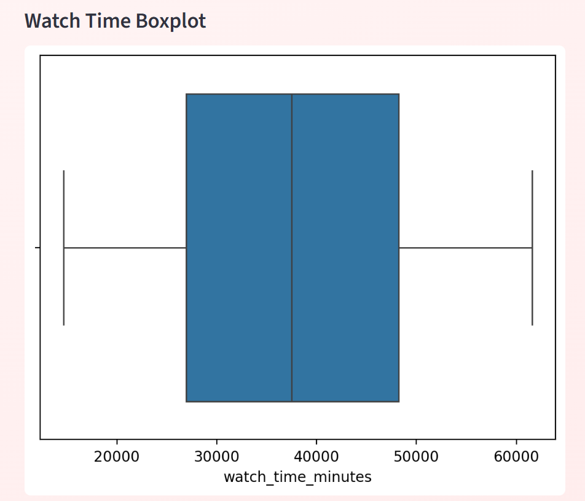
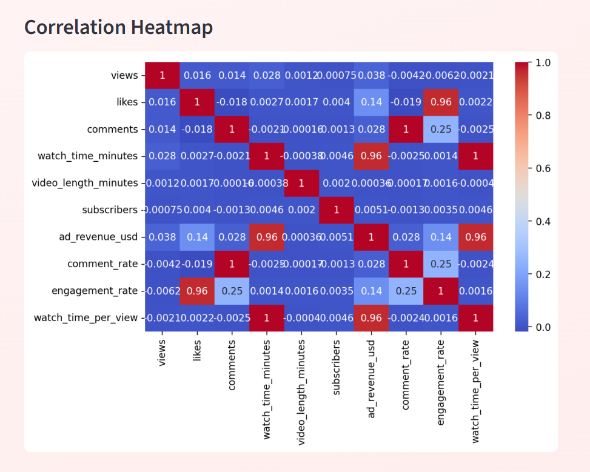

# YouTube Revenue Predictor

An end-to-end Machine Learning project that predicts **YouTube ad revenue** using regression models based on video performance and engagement metrics.

---

## Project Overview

This project helps content creators and media companies estimate potential revenue from YouTube videos.
By analyzing performance metrics such as views, likes, comments, and engagement rate, the model predicts expected ad revenue.

---

## Features

* Exploratory Data Analysis (EDA)
* Data Cleaning & Preprocessing
* Feature Engineering (e.g., Engagement Rate)
* Multiple Regression Models
* Model Evaluation (R², RMSE, MAE)
* Interactive Streamlit Dashboard

---

## Streamlit Application

The application allows users to:

* Input video performance metrics
* Predict estimated ad revenue
* Explore data insights through EDA dashboard

---

## Dashboard Preview

## 📸 Dashboard Preview

---

### 🏠 EDA Dashboard



---

### 📊 Distribution Analysis



---

### 📈 Relationship Analysis





---

### 📦 Statistical Analysis


---

### 🔥 Correlation Analysis


---

### 💰 Prediction Page


---

## Model Building

The following regression models were implemented and compared:

* Linear Regression
* Decision Tree Regressor
* Random Forest Regressor
* Gradient Boosting Regressor

The best model was selected based on evaluation metrics.

---

## Evaluation Metrics

* R² Score
* Root Mean Squared Error (RMSE)
* Mean Absolute Error (MAE)

---

## Project Structure

```
youtube-revenue-predictor/
│
├── app/                  # Streamlit application
│   ├── app.py
│   ├── model_pipeline.pkl
│
├── data/                 # Dataset files
│   ├── youtube_df_cleaned.csv
│   ├── youtube_ad_revenue_dataset.csv
│
├── notebooks/            # Jupyter notebooks
│   ├── 01_EDA_and_Feature_Engineering.ipynb
│   ├── 02_Model_Building_and_Evaluation.ipynb
│
├── README.md             # Project documentation
├── requirements.txt      # Dependencies
└── .gitignore
```

---

## Installation

```bash
git clone https://github.com/your-username/youtube-revenue-predictor.git
cd youtube-revenue-predictor
pip install -r requirements.txt
```

---

## ▶Run the Application

```bash
streamlit run app/app.py
```

---

## Tech Stack

* Python
* Pandas, NumPy
* Scikit-learn
* Matplotlib, Seaborn
* Streamlit

---

## Project Status

* ✅ EDA & Feature Engineering completed
* ✅ Model Building & Evaluation completed
* ✅ Streamlit Dashboard implemented

---

## Future Improvements

* Hyperparameter tuning
* Advanced models (XGBoost, LightGBM)
* Enhanced UI/UX for Streamlit
* Deployment to cloud (Streamlit Cloud / AWS)

---

## Acknowledgements

This project was developed as part of a machine learning learning journey focused on building end-to-end data science solutions.

---

## Author

Sangeetha 

